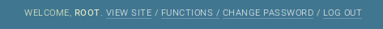
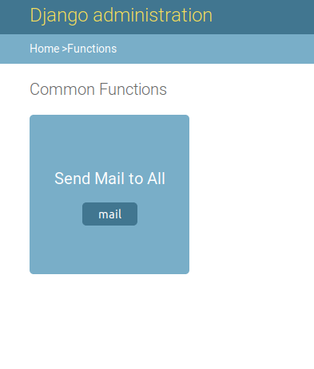
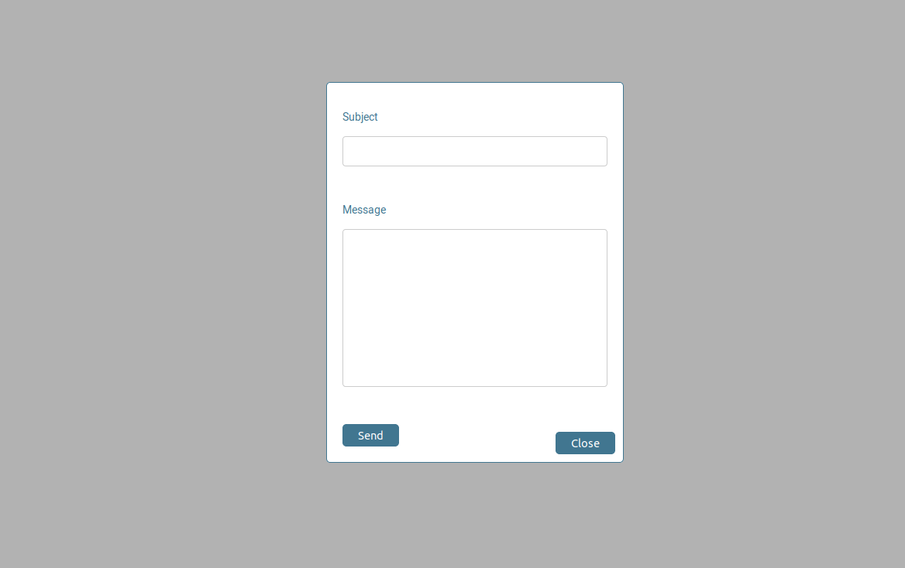
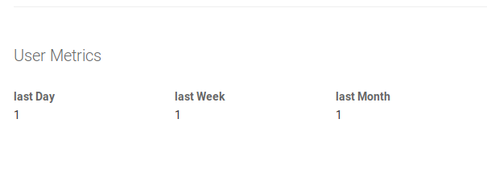
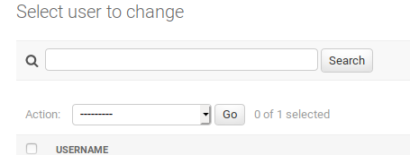

# Django Admin Customization

Imp files 
- AdminCutomzation/admin.py
  - this file has the custom admin site class extending from the django admin site class
     New url and actions for admin are in this file 
     For example fuctions page and the send mail action,Also the backend code of user metrics
     
 - templates 
   - admin/function.html
      this is the functions page of the site from which mails to all users can be sent
   - admin/index.html
       jinga code for user metrics added 
       
 - accounts
     - models : User model
     - managers.py : UserManager
     - modeladmin : UserAdmin which has code for change status action
     
     
     

### Useful pics

#### Functions page
</img>
#### send mail
</img>

#### Mail Form
</img>

#### User Metrics
</img>

#### Change Status

</img>